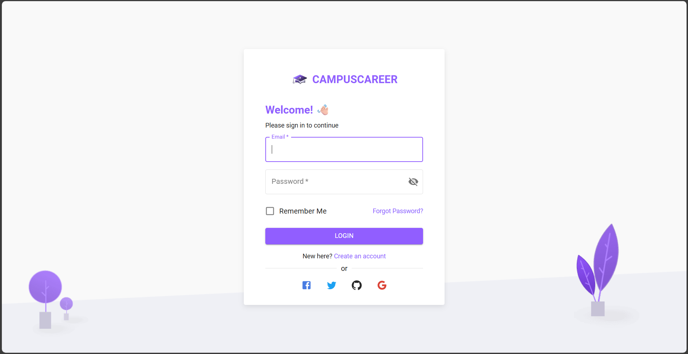
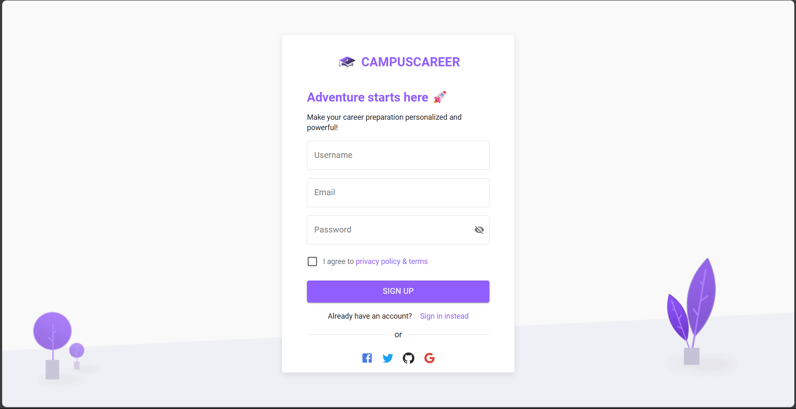
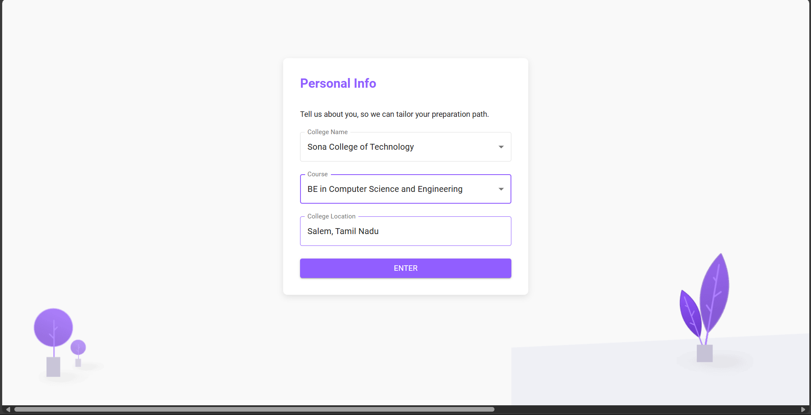
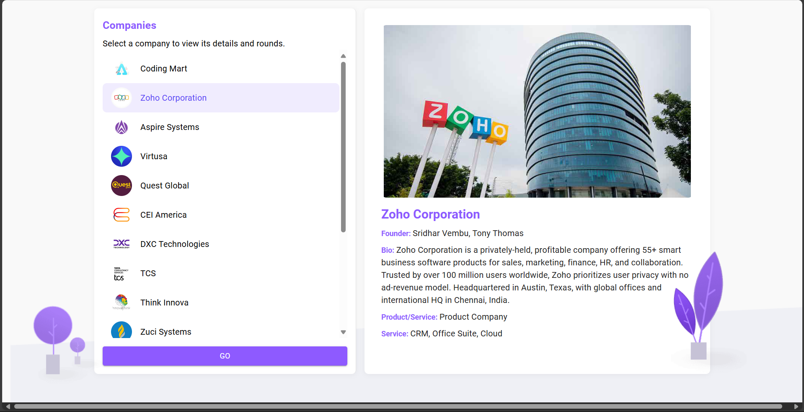
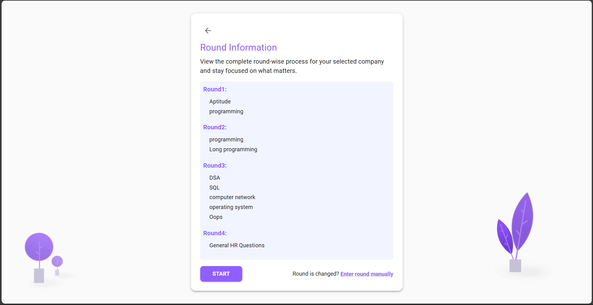
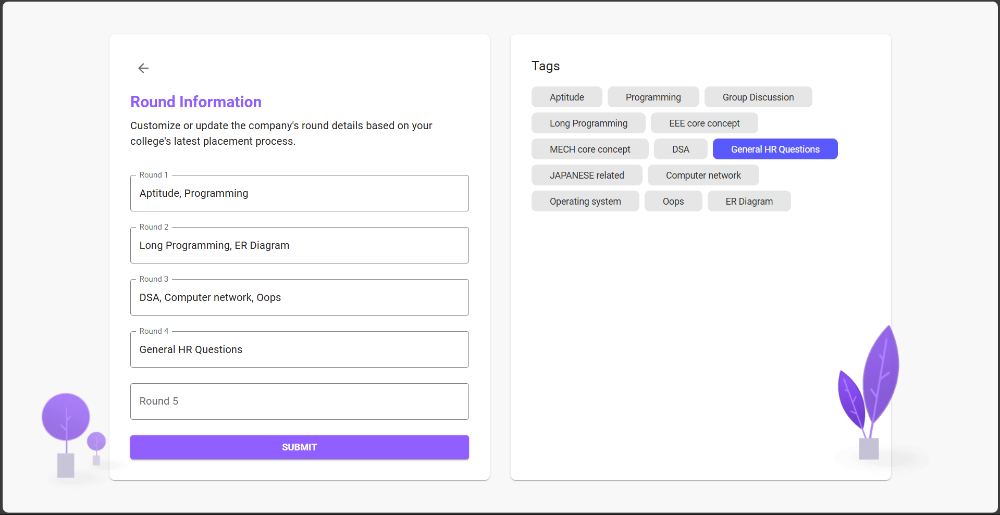
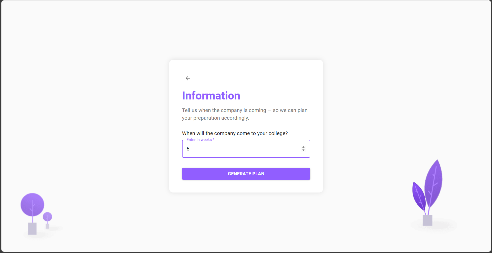
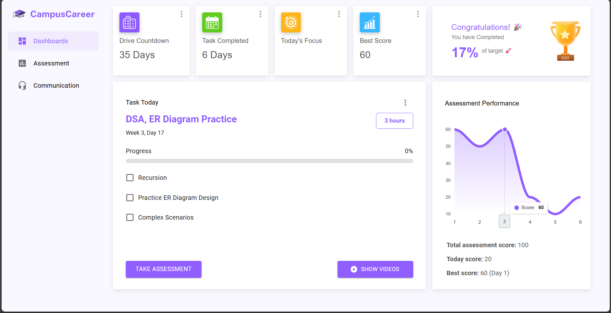
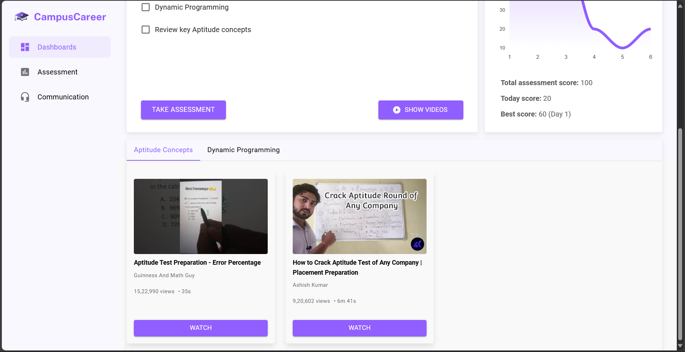
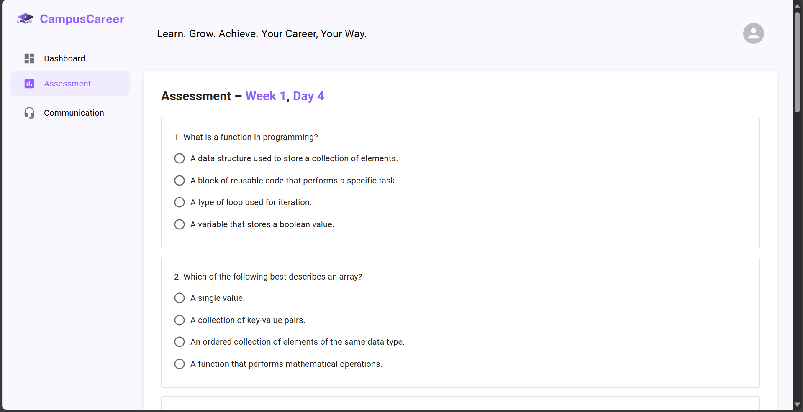

# CampusCareer 🚀

**CampusCareer** is a placement preparation platform that offers personalized learning paths tailored to the specific companies visiting your college campus. It helps students prepare efficiently for interviews by providing structured study plans, feedback systems, and access to curated video resources using AI integration.


## Screenshots

<table>
  <tr>
    <td>
      <strong>System Screen:</strong><br>
      <a href="https://github.com/sowndappan5/Forest-Fire-Detection-and-Distance-Estimation/blob/main/Media/Forest%20fire%20Screen%20View.mp4">
        
      </a>
    </td>
    <td>
      <strong>Real Time:</strong><br>
      <a href="https://github.com/sowndappan5/Forest-Fire-Detection-and-Distance-Estimation/blob/main/Media/forest%20fire%20side%20view.mp4">
        
      </a>
    </td>
    <td>
      <strong>System Screen:</strong><br>
      <a href="https://github.com/sowndappan5/Forest-Fire-Detection-and-Distance-Estimation/blob/main/Media/Forest%20fire%20Screen%20View.mp4">
        
      </a>
    </td>
    <td>
      <strong>Real Time:</strong><br>
      <a href="https://github.com/sowndappan5/Forest-Fire-Detection-and-Distance-Estimation/blob/main/Media/forest%20fire%20side%20view.mp4">
        
      </a>
    </td>
    <td>
      <strong>System Screen:</strong><br>
      <a href="https://github.com/sowndappan5/Forest-Fire-Detection-and-Distance-Estimation/blob/main/Media/Forest%20fire%20Screen%20View.mp4">
        
      </a>
    </td>
    <td>
      <strong>Real Time:</strong><br>
      <a href="https://github.com/sowndappan5/Forest-Fire-Detection-and-Distance-Estimation/blob/main/Media/forest%20fire%20side%20view.mp4">
        
      </a>
    </td>
    <td>
      <strong>System Screen:</strong><br>
      <a href="https://github.com/sowndappan5/Forest-Fire-Detection-and-Distance-Estimation/blob/main/Media/Forest%20fire%20Screen%20View.mp4">
        
      </a>
    </td>
    <td>
      <strong>Real Time:</strong><br>
      <a href="https://github.com/sowndappan5/Forest-Fire-Detection-and-Distance-Estimation/blob/main/Media/forest%20fire%20side%20view.mp4">
        
      </a>
    </td>
    <td>
      <strong>System Screen:</strong><br>
      <a href="https://github.com/sowndappan5/Forest-Fire-Detection-and-Distance-Estimation/blob/main/Media/Forest%20fire%20Screen%20View.mp4">
        
      </a>
    </td>
    <td>
      <strong>Real Time:</strong><br>
      <a href="https://github.com/sowndappan5/Forest-Fire-Detection-and-Distance-Estimation/blob/main/Media/forest%20fire%20side%20view.mp4">
        
      </a>
    </td>
  </tr>
</table>

---

## 🌟 Features

- ✅ Personalized company-wise preparation plans
- 🎯 Gemini AI integration for learning recommendations
- 🎥 YouTube API for educational video content
- 📊 Dashboard to track preparation progress
- 💬 Voice-based practice using Speech Recognition and TTS
- 🔐 Authentication system (Login/Signup)

## 📁 Tech Stack

- **Frontend:** React + Vite + Material UI (MUI)
- **Backend:** Flask (Python)
- **APIs Used:** Gemini, YouTube API, Speech Recognition, TTS

---

## 🛠️ Installation & Setup

Follow these steps to set up the project locally:

### 1. Clone the Repository

```bash
git clone https://github.com/sowndappan5/campuscareer.git
cd campuscareer
```

---

### 2. Frontend Setup (React + Vite)

Make sure you have Node.js installed

```bash
cd mui-dashboard
pip install -r requirements.txt
npm install
npm run dev   # Starts development server on localhost:5173 (default)
```

---

### 3. Backend Setup (Flask)

Make sure you have Python installed

```bash
cd mui-dashboard
cd flask
python app.py   # or use flask run
```

The backend server will usually run on `http://localhost:5000`.

---

## ✅ Usage

1. Run the Flask backend (`python app.py`).
2. Start the React frontend (`npm run dev`).
3. Open the app in your browser at [http://localhost:5173](http://localhost:5173).
4. Register/Login to access personalized content.
5. Use voice practice, get video recommendations, and track your preparation.

---

⚠️ Note: Some files or sections of the code have been removed or redacted from this public repository to protect sensitive information, internal configurations, or proprietary logic. The remaining code still reflects the overall structure, logic, and approach used in the project.


## 📬 Contact

Created by

- Sowndappan S – [LinkedIn](https://linkedin.com/in/sowndappan/)
- Mythili S – [LinkedIn](https://linkedin.com/in/mythili-s-16s/)

For any queries or collaboration: 2k22it50@kiot.ac.in
